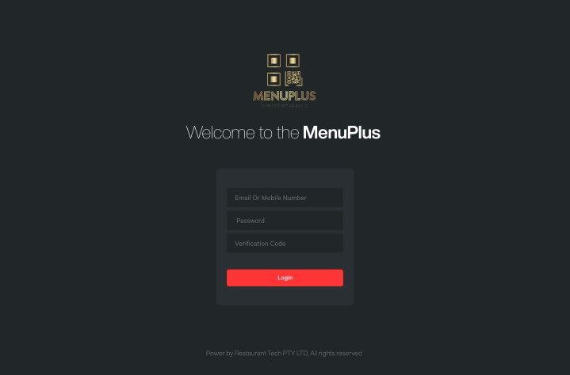
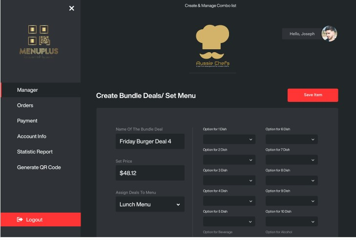
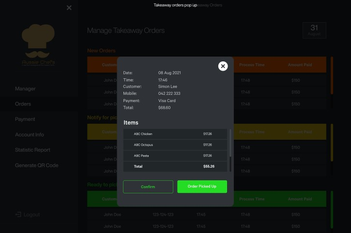

## RestuarantAdminPortal

<div align='center'>
    

</div>
<br>
<div align='center'>
     <br>
     <br>
     <br>

</div>


## Installation

- clone repo ``` git clone <repo-url> ```
- cd into repo
- modify .env to connect to your local database. if you don't know how here is guide <https://lavalite.org/blog/connecting-your-laravel-project-to-mysql-database>
- run composer install and npm install ``` composer install ``` &&  ``` npm install ```
- run migration and seed the database ``` php artisan migrate ``` && ``` php artisan db:seed ```
- use laravel tinker to create users/customers
- run  ``` php artisan tinker ``` &&  ``` App\Models\User::factory()->count(12)->create(); ```
- create user login cred for your with tinker as well
- run ``` php artisan tinker ``` && ``` User::create(["name"=> "your_name","email"=>"your@gmail.com","password"=>bcrypt("123456") ```
- start application with ``` php artisan serve --port=9090 ```
- login with the user cred you just created
